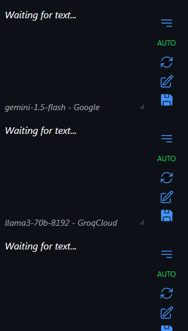

# About

## How to get it
download it in the releases section

## How it works
it receives the text through clipboard changes (if the document is visible) or a configured websocket server, and then translates it with AI models. it is this way so it can receive text from tools like [textractor](https://github.com/Artikash/Textractor).

#### AI Models
in all models available you can get a free API key. I want this repo to be also a hub of nice and free AI models. if you have a suggestion of a model with a good provider, feel free to suggest me or open a PR.

## Caching
the translation of your favorite AI model (the first) is cached by default in **%appdata%\ai-translate**. it's cached in a **.xlsx** file, so it can be imported to translator++

**warning:** for the import to work, it's required that the texts are strictly equal. so be careful with OCR and text hooks that includes the speaker name. if the game doesn't follow the pattern of putting the lines inside of「」(except for narration), the app won't be capable of splitting the line from the speaker name.

#### Demo


## Models
the available models are:  
o1, claude-3-opus, claude-3.5-sonnet  
DeepSeek-R1, DeepSeek-V3, gpt-4o, gpt-4o-mini, gpt-3.5-turbo  
gemini, cohere models, Qwen, llama  
other models: mixtral, nous mixtral, yi, and etc.  

there's also available: DeepLX, google translate, and SugoiV4

**Warning:** some providers or some big models have lower rate limits, don't use them with auto fetch enabled.  
**auto fetch:** the toggle option to automatically fetch the translation when receiving the original text. this option allows you to add as many models as you want without burning your api keys, you can add heavier models and use them only for difficult lines.  


## Build
if you want to create your own build

```bash
# install the frontend dependencies
$ npm install

# install the python dependencies
$ pip install -r webview\pywebview\requirements.txt

# run the vite server (useful in development)
$ npm run dev

# build the html, css and js files
$ npm run build

# preview the webview
$ npm run start

# build the exe (python)
$ npm run pack
```

#### The addition of a webview in go is WIP

## todo

#### finish the webview in go  
- fix: Update DTO structure
- add speaker name handler for go xlsx module  
- add csv loading  
- hide cmd window for "OpenConfigDir"  
- fix: remove fatal log from "GetConfig"  
- set window's dimensions  
- fix url and set title for "OpenConfigWindow"  
- add debug flag  

search for more providers
